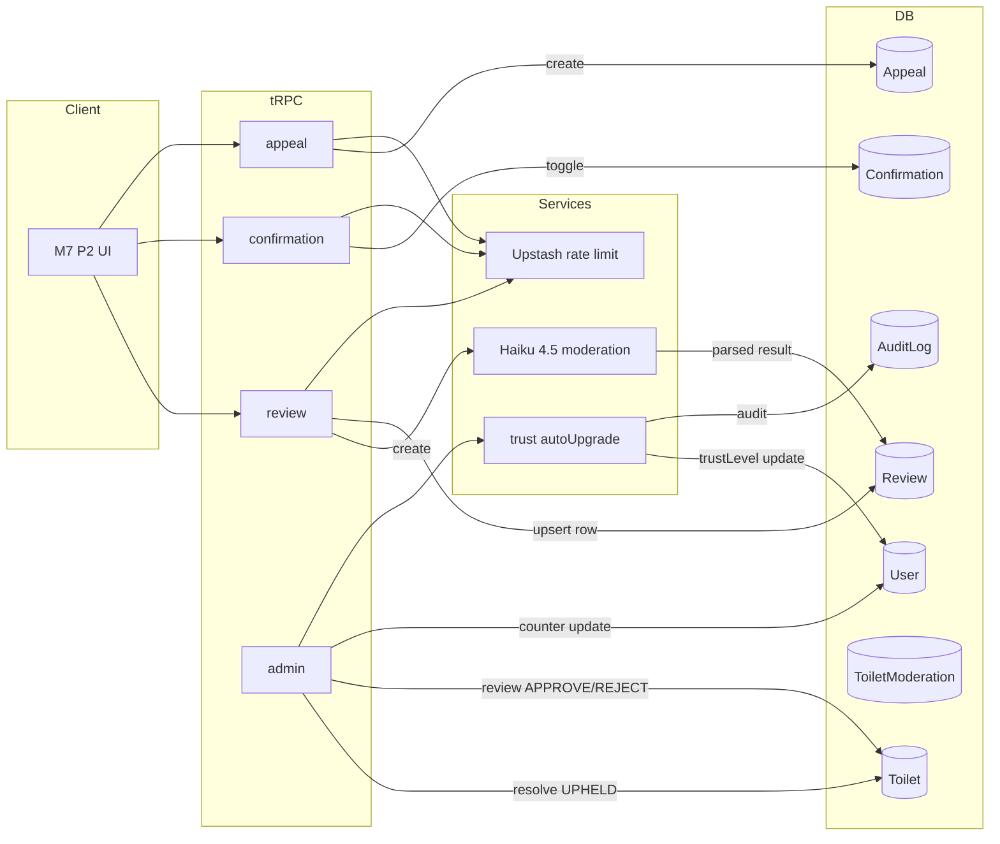

# M7 Social Layer · P1 Data + API

P1 is data + API only. UI lives in P2 / P3. This doc is the contract P2
reads before writing React components.

---

## Architecture

---

## Trust ladder (binding definition)

| Level | Qualifying rule                                            | Capabilities unlocked                      |
| ----- | ---------------------------------------------------------- | ------------------------------------------ |
| 0     | Default for new users                                      | Browse map, toggle `Confirmation`          |
| 1     | `approvedSubmissions ≥ 1`                                  | + Post `Review` (rating + body + photos)   |
| 2     | `approvedSubmissions ≥ 5` AND `rejectedRate < 10%`          | + File `Appeal` (own reject + bad data)    |
| 3     | `approvedSubmissions ≥ 20` AND admin manual grant          | AI moderation skipped for this user's content (future: reserved; not yet wired) |

Auto-upgrade path: `L0 → L1 → L2` is computed by
`src/server/trust/autoUpgrade.ts` on every submission/review status
transition. `L2 → L3` is _never_ automatic — at ≥20 approved the
function logs `TRUST_L3_ELIGIBLE` to `AuditLog` so an admin console
(M7 P3 / later) can surface it.

No automatic demotion. Banned users are filtered by
`canReviewToilet` / `canAppeal` via `isBanned()` rather than by
dropping their trustLevel.

---

## tRPC API table

### `review` router

| Procedure          | Auth              | Rate limit          | Purpose                                         |
| ------------------ | ----------------- | ------------------- | ----------------------------------------------- |
| `create`           | `protected` + L1+ | `review:create` 5/h | Upsert my review for one toilet, runs Haiku     |
| `listByToilet`     | `public`          | —                   | Paginated APPROVED reviews for one toilet       |
| `listMine`         | `protected`       | —                   | My reviews incl. PENDING/REJECTED               |
| `delete`           | `protected`       | —                   | Soft-delete my own review (status → HIDDEN)     |

`create` input shape: `{ toiletId, rating: 1..5, body?: string, photoKeys?: string[] }` (photoKeys are R2 keys, reused from M5 upload pipeline).

Returns: `{ id, status: 'PENDING' | 'REJECTED' }`. Status reflects
Haiku's verdict applied through `applyModerationPolicy` — only
high-confidence (`≥ 0.85`) REJECT lands as `REJECTED`.

### `confirmation` router

| Procedure          | Auth              | Rate limit              | Purpose                                |
| ------------------ | ----------------- | ----------------------- | -------------------------------------- |
| `toggle`           | `protected` + L0+ | `confirmation:toggle` 20/h | Flip "still exists" ack for one toilet |
| `countByToilet`    | `public`          | —                       | Count + self-flag                      |

Toggle semantics: first call creates, second call deletes. The presence
of the row IS the "yes, still exists" signal. No cooldown (M6 legacy
30-day rule dropped in P1).

### `appeal` router

| Procedure          | Auth              | Rate limit          | Purpose                                      |
| ------------------ | ----------------- | ------------------- | -------------------------------------------- |
| `create`           | `protected` + L2+ | `appeal:create` 3/d | File an Appeal (two types)                   |
| `listMine`         | `protected`       | —                   | My appeals, all statuses                     |
| `listPending`      | `admin`           | —                   | Paginated PENDING queue for moderators       |
| `resolve`          | `admin`           | —                   | UPHELD or DISMISSED; UPHELD flips Toilet     |

`create` types:

- `OWN_SUBMISSION_REJECT`: `targetToiletId` must be a Toilet submitted
  by the caller with `status = REJECTED`.
- `BAD_APPROVED_DATA`: `targetToiletId` must be a Toilet with
  `status = APPROVED` (any submitter).

`resolve` side effects:

- `UPHELD + OWN_SUBMISSION_REJECT` → `Toilet.status` flips `REJECTED → APPROVED` (+ `publishedAt = now`).
- `UPHELD + BAD_APPROVED_DATA` → `Toilet.status` flips `APPROVED → REJECTED`.
- `DISMISSED` → target untouched; only `Appeal.status` changes.

Duplicate guard: one `PENDING` appeal per `(userId, targetToiletId)` pair.

---

## Haiku moderation extension

`moderateToilet(toiletId)` unchanged (M6).

New: `moderateReview(reviewId)` in
`src/server/anthropic/moderation.ts`. Review prompt in
`REVIEW_MODERATION_SYSTEM_PROMPT` (in moderation-prompt.ts). Issue
flags are review-specific (`spam_or_gibberish`, `offensive_or_hateful`,
`personal_attack`, `personally_identifiable_info`, `off_topic`,
`photo_policy_violation`).

Shared `applyModerationPolicy(PolicyInput)` widened to structural
`{ decision, confidence }` input — reuses the same AUTO_REJECT
threshold (0.85 confidence REJECTED) for both toilet and review.

Review moderation writes inline to the `Review` row
(`aiDecision` / `aiConfidence` / `aiReasons` / `aiRawText` /
`aiModeratedAt`), not to `ToiletModeration`.

---

## DB impact summary

- **Reshape** `Review`: drop `cleanliness`, `comment`, `originalLocale`,
  `rejectedReason`; add `rating`, `body`, `photoKeys`, and 5 AI fields.
- **Reshape** `Confirmation`: drop `stillAvailable`, `note`; add
  `@@unique(toiletId, userId)`.
- **New model** `Appeal` + `AppealType` + `AppealStatus` enums.
- **Extend** `User` with `autoTrustChecked Boolean`.
- **Extend** `ReviewStatus` enum with `HIDDEN`.
- **CHECK constraints** (raw SQL in migration):
  - `Review_rating_range`: rating ∈ [1, 5]
  - `Appeal_target_required`: targetToiletId NOT NULL

See migration `20260421103000_M7_P1_social_layer/migration.sql`.

---

## Design choice log

**ToiletModeration polymorphic vs. inline in Review — picked inline.**
M6's `ToiletModeration` is 1:1 with Toilet. Extending it to
polymorphically link `Review | Toilet` needs nullable FKs + a check
constraint + a uniqueness compromise. The review admin queue (M7 P3)
queries `Review` filtered by `status=PENDING` directly — no join
through a moderation table buys us anything. Inlining
`aiDecision / aiConfidence / aiReasons / aiRawText / aiModeratedAt` on
`Review` is ~6 columns of identical semantics to `ToiletModeration`,
costs less churn, and reduces Prisma 7 drift risk.

**Appeal separate from OwnerDispute.** `OwnerDispute` (M1 T2.1) models
business-owner takedown requests — different form, different gating,
different escalation. User appeals are a new surface with its own
status semantics. Kept apart.

**No admin-notification channel in P1.** `appeal.create` logs to stdout
and relies on admin polling `appeal.listPending`. P3's admin UI will
refresh that list; a real push channel (email / webhook) is post-MVP.

**Rate-limit key rename, not extend.** Old unused keys
`review:submit` / `confirmation:submit` renamed to
`review:create` / `confirmation:toggle` so naming matches the
procedures. No orphan Redis counters to migrate (no callers yet).
